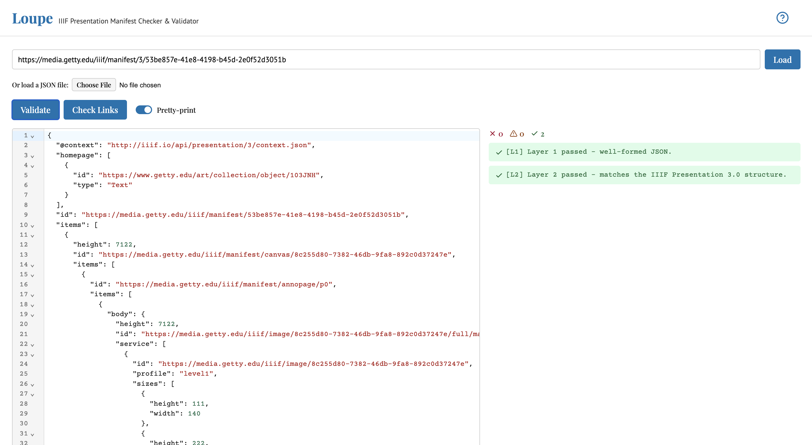

# loupe-iiif



loupe-iiif is a browser extension that checks and validates **[IIIF](https://iiif.io) manifests**: the JSON files that tell viewers how to present digital objects (A/V, books, artworks, maps, scores) and where to find their media.

IIIF manifests can break in ways that are hard to spot: a missing comma, a misspelled field, an image URL that quietly 404s. loupe-iiif identifies and flags these issues - all in your browser.

**How it works:** paste a manifest, load it from a URL, or open a file. It appears in a code editor, and loupe-iiif checks it as you type. Problems are underlined where they occur and listed in a report; click any finding to jump to the exact spot in the JSON.

**What it checks**, in order: is it valid JSON → does it match the [IIIF Presentation API](https://iiif.io/api/presentation/) structure for the version it declares → do the URLs it references actually resolve → does it follow best practices (rights, labels, thumbnails).

loupe-iiif auto-detects the Presentation API version from a manifest's `@context` and validates against that version's rules. **Supported today: [2.1](https://iiif.io/api/presentation/2.0/) and [3.0](https://iiif.io/api/presentation/3.0/).** Presentation 4 is still a draft upstream; loupe-iiif will add support once its shape stabilizes. A manifest whose `@context` doesn't match a supported version gets a single clear error rather than a wall of unrelated schema failures.

## The layers

The extension has four layers of checks.

| Tag    | Layer              | Question                                                   |
| ------ | ------------------ | ---------------------------------------------------------- |
| `[L1]` | Well-formedness    | Is it parseable JSON?                                      |
| `[L2]` | Spec conformance   | Does it match the Presentation API structure (2.1 or 3.0)? |
| `[L3]` | Linking            | Do referenced URLs resolve?                                |
| `[L4]` | Best-practice lint | Valid but ill-advised?                                     |

## Install

- **Chrome:** [Chrome Web Store](https://chromewebstore.google.com/detail/loupe-iiif/bnnoohiohbljoianldgbnepljodndmdo)
- **Firefox:** [Firefox Add-ons](https://addons.mozilla.org/en-US/firefox/addon/loupe-iiif/)

## Install (from source)

Requires [Node.js](https://nodejs.org) 22 or later (any OS) with npm, bundled with Node. To build:

```sh
npm install
npm run build            # Chrome build → dist-chrome/
npm run build:firefox    # Firefox build → dist-firefox/
```

Each target builds to its own directory - Chrome and Firefox need different `background`
keys (`service_worker` vs `scripts`), so the two builds are never allowed to overwrite
each other on disk.

Then load the matching directory as an unpacked extension:

- **Chrome:** `chrome://extensions` → enable Developer mode → _Load unpacked_ → select `dist-chrome/`.
- **Firefox:** `about:debugging` → This Firefox → _Load Temporary Add-on_ → select `dist-firefox/manifest.json`, then grant host permissions in `about:addons` → loupe-iiif → Permissions (needed for URL loading and link checking).

Click the toolbar icon to open the workbench in a full tab.

## Develop

```sh
npm run dev        # watch + auto-reload in a dev browser
```

Built with **Manifest V3**, **TypeScript**, **Svelte 5**, **CodeMirror 6**, **Vite** (`vite-plugin-web-extension`), and **Ajv** for JSON Schema validation. Because MV3's content security policy forbids `eval`, the IIIF schema is **precompiled to a standalone, eval-free validator at build time** (`scripts/build-validator.js`) rather than compiled in the browser.

```sh
npm test           # Vitest suite for the validation logic
npm run typecheck  # svelte-check
```

## License

ISC. See [LICENSE](./LICENSE).
